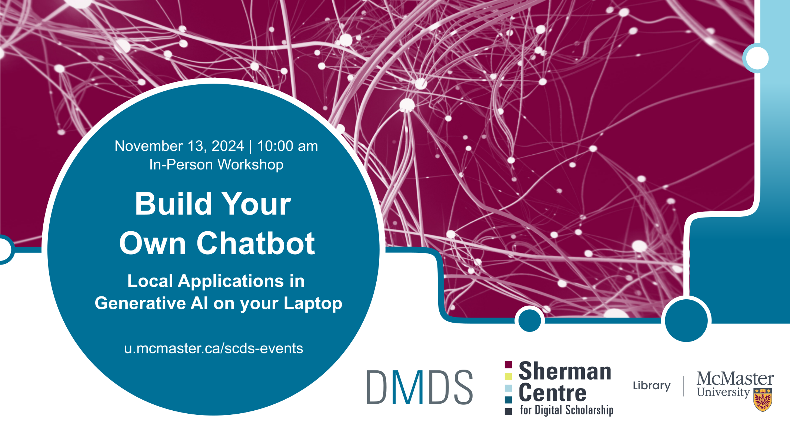

# Build Your Own Chatbot: Local Applications in Generative AI on your Laptop

Everyone is familiar with cloud-based generative AI, like ChatGPT. However, the driving technology behind most modern AI systems -- the transformers-based Larage Language Model architecture -- is flexible enough to run on recent commodity hardware like your laptop.

In this **in person** workshop, we will explore the technology behind AI systems and set up and use a basic AI on your laptop you can chat with.

## Facilitator Bios

John Fink (he/they) is the Digital Scholarship Librarian at McMaster University Library. Their talents lie in complex and innovative systems administration and project management. He also has an interest in the maker/hacker element in digital scholarship, and is frequently spotted tinkering with esoteric hardware. If you are interested in having the Sherman Centre support your project, John is an excellent first contact.
