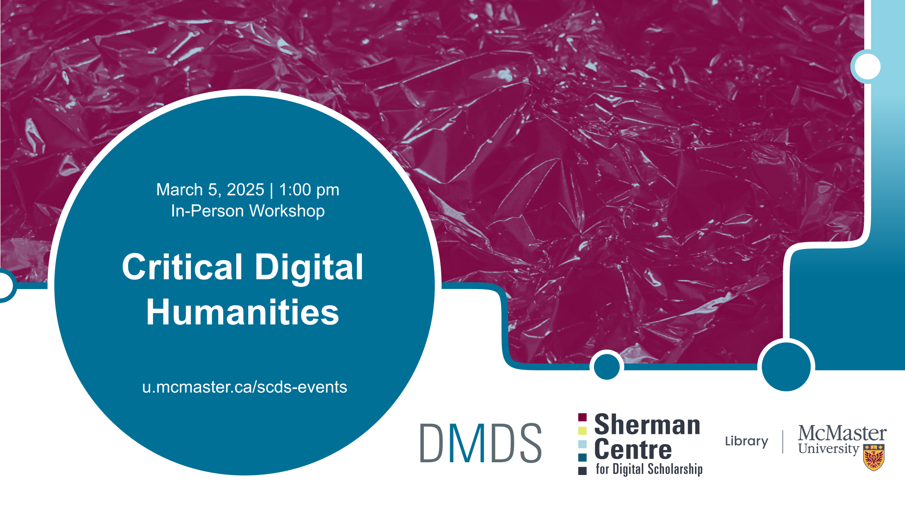

# Introduction to Critical Digital Humanities
Join us for a workshop that introduces the field of Critical Digital Humanities. This interdisciplinary field emphasizes questions of power, social justice, and critical theory in the creation and analysis of digital projects. Through interactive discussions, hands-on exercises, and case studies we will explore the potential in these tools for social and political transformation. This workshop will introduce you to the knowledge and skills to utilize digital tools for research, analysis, and visualization, and ask questions from critical perspectives, and collaborate with others to advance social justice and equity.

## Facilitator Bios
Subhanya Sivajothy (she/her) brings a background of research in data justice, science and technology studies, and environmental humanities. She is currently thinking through participatory data design which allow for visualizations that are empowering for the end user.

Devon Mordell is an Educational Developer at The MacPherson Institute for Teaching and Learning. Devon draws on her experience in media art, hobbyist programming and instructional design to teach workshops for the Sherman Centre. Her areas of interest in digital scholarship include data visualization, computational analyses of texts, sonification and critical digital humanities. Her research practice explores the algorithmic culture industry and platform psychogeography.
