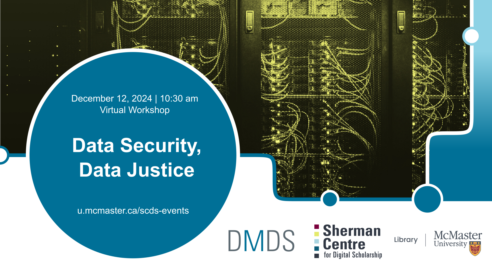

# Cybersecurity, Critical Data, and Social Justice
This spring, Hamilton was incapacitated by a ransomware attack we are still recovering from months later. In addition to ransomware, universities also be a target for intellectual property and research theft (Forbes). While keeping our networks secure is important, there are also critical equity considerations in how populations are disproportionately targeted and impacted by data breaches. 

In this 1-hour webinar, learn more about cybersecurity and data justice. We'll start with best practices for keeping data safe, the context of equity in relation to data breaches, critical data visualization, and approaches to involving research participants in how their data is managed. Then, we'll unpack ripped-from-the-headlines case studies to explore social justice implications.

## Workshop Preparation 

## Facilitator Bios

<!--
## Contents

|Segment|Time Allotted|Key Topics / Activities|
|:--|:--|:--|
|**Introductory remarks**|20 minutes|Introduction to text preparation and analysis   Overview of concepts and methods   Key considerations for different source materials and analyses|
-->

  
## Workshop Recording
*Coming soon*.

<!--
<iframe height="416" width="100%" allowfullscreen frameborder=0 src="https://echo360.ca/media/9602ee54-24a4-4c61-bfd1-a8aa550a1cd5/public"></iframe>
[View original here.](https://echo360.ca/media/9602ee54-24a4-4c61-bfd1-a8aa550a1cd5/public)
-->

## Workshop Slides
*Coming soon*.

<!--
<embed src="assets/docs/textAnalysisSlides.pdf" style="border:none;" width="100%" height="466px">
[Download as PDF.](assets/docs/textAnalysisSlides.pdf)
-->

<!--
## Links and Resources 
- [Constellate](https://constellate.org/) is a text analysis learning and analysis platform supported by JSTOR Labs and ITHAKA. 
-->

