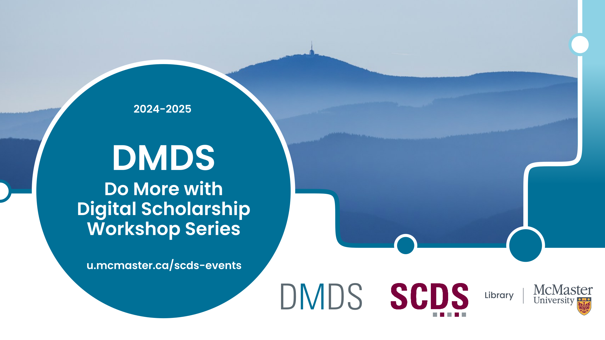



# Welcome to the 2024-2025 Do More with Digital Scholarship Webinars

What is digital scholarship, how can I do more with it, and how can it contribute to my research and teaching? Join us for our free workshop series that introduces McMaster students, faculty, and staff to the multifaceted domain of digital scholarship.

Join us to: 
- Develop skills for professionalization.
- Learn to use software to create digital exhibits, perform data analysis and create dashboards, and organize your research images.
- Engage with faculty, staff, and students on a wide range of topics.
- Learn more about digital approaches to research and knowledge mobilization.
- Explore the intersections between digital scholarship and critical humanities; cybersecurity and data justice. 

## 2024-25 DMDS Workshops

  Workshops

<ul>


<li><a href="{{workshop.url | absolute_url}}">{{workshop.title}}</a></li>


</ul>

