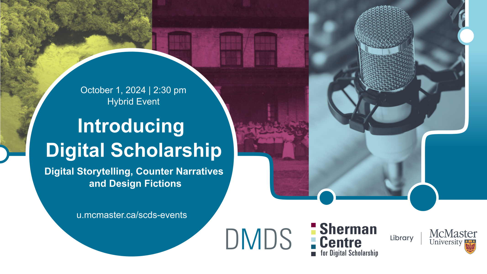

# Storying disability: Digital community archives as public memorial at New York’s Craig Colony for Epileptics 
My project seeks to understand patient experiences with institutionalization at the Craig Colony for Epileptics in Sonyea, New York. As the first such institution for disabled people in the United States, the Craig Colony occupies an important role in disability history, yet little attention has been paid to the experiences of the patients forced to live there. This project integrates oral histories with survivors alongside archival research and photographs into an interactive digital map for users to explore and navigate using the design tool Vev. In this presentation, I will showcase the map and discuss the possibilities digital storytelling can offer as a strategic practice of remembrance in unearthing disability history, as well as how such strategic practices can help advocate for new and better futures for disabled communities.

## Presenter Bio
**Katie Waring (she/her)** is a multimedia writer and doctoral candidate in the Communication, New Media, and Cultural Studies program at McMaster. Her research aims to understand the potential for community-engaged digital storytelling in highlighting suppressed histories. She holds an MFA in nonfiction writing from the University of Pittsburgh and her creative work has been published in literary journals such as The Normal School and American Literary Review, among others. She’s originally from New York State.

## Presentation Recording
*Coming soon*.

<!--
<iframe height="416" width="100%" allowfullscreen frameborder=0 src="https://echo360.ca/media/9602ee54-24a4-4c61-bfd1-a8aa550a1cd5/public"></iframe>
[View original here.](https://echo360.ca/media/9602ee54-24a4-4c61-bfd1-a8aa550a1cd5/public)
-->