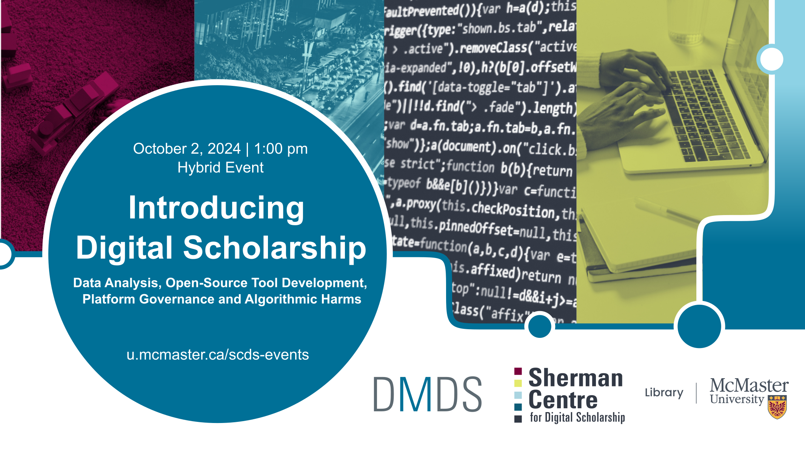

# Introducing Digital Scholarship 2: Data Analysis, Open-Source Tool Development, Platform Governance and Algorithmic Harms

In the second installment of this two-event series, learn more about the interdisciplinary, multifaceted, and emergent approaches to digital scholarship from our [2024 Graduate Residency](https://scds.ca/2024-grad-residents/) cohort.

[Register for this workshop](https://libcal.mcmaster.ca/calendar/scds/intro-ds2){: .btn .btn-outline }

  Presentations

- [Developing standardized methods for transportation analysis](intro-ds2/standardized-transportation-analysis)
- [Unlocking toddler activity insights: Introducing an easy-to-use machine learning tool for everyone](intro-ds2/toddler-activity-insights)
- [Understanding the role of civil society in multistakeholder global platform governance at UNESCO](intro-ds2/civil-society-unesco)
- [Understanding the nature and risks of welfare algorithmic harms](intro-ds2/welfare-algorithmic-harms)
- [Breaking the silence: Understanding HPV vaccination gaps among canadian men](intro-ds2/breaking-the-silence)

## Event Recording

<iframe height="416" width="100%" allowfullscreen frameborder=0 src="https://echo360.ca/media/0070d912-010e-4784-95f0-b75d8b8190d9/public"></iframe>
[View original here.](https://echo360.ca/media/0070d912-010e-4784-95f0-b75d8b8190d9/public)