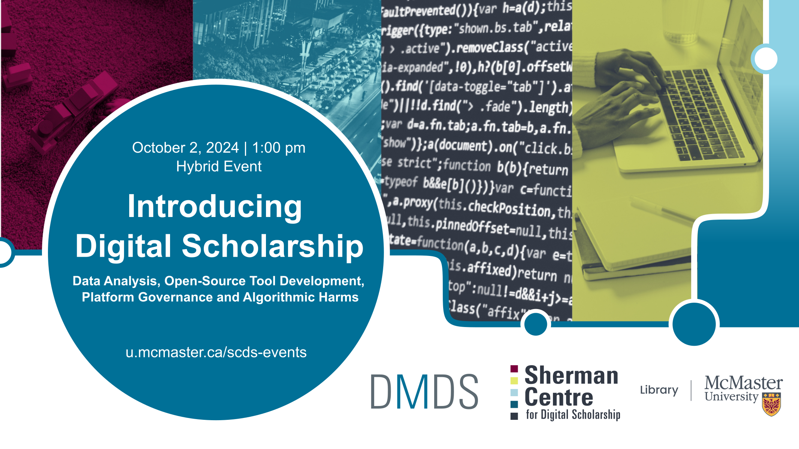

# Understanding the role of civil society in multistakeholder global platform governance at UNESCO
In October 2023, UNESCO released its 'Guidelines for the Governance of Digital Platforms,' a major step in global digital platform governance by an international intergovernmental body. The Guidelines were developed through multistakeholder consultations occurring from December 2022 to June 2023, involving the public and private sectors, civil society, media, academia, and the technical community. The consultation process engaged 134 nations and received over 10,000 comments, making it one of UNESCO’s largest open consultations to date. Although UNESCO offered select quantitative data to showcase the diversity of stakeholders involved and to summarize feedback received, these summaries provide an incomplete picture of the multistakeholder process. My project uses the anonymized consultation data to critically assess the multistakeholder quality of the consultations, particularly highlighting concerns from civil society in the Global South. This presentation will explore alternative data visualizations to better represent these voices, offering a critical perspective on the institutional narrative. 

## Presenter Bio
**Brad McNeil (He/Him)** is a Ph.D. candidate in the Department of Communication Studies and Media Arts at McMaster University.  His research interests lie at the multiple intersections between freedom of expression, content moderation, and platform governance. His doctoral research focuses on global platform governance, with special attention to the ways that international organizations such as Intergovernmental institutions and non-governmental organizations are structuring a vision of global platform governance.    

## Presentation Recording
*Coming soon*.

<!--
<iframe height="416" width="100%" allowfullscreen frameborder=0 src="https://echo360.ca/media/9602ee54-24a4-4c61-bfd1-a8aa550a1cd5/public"></iframe>
[View original here.](https://echo360.ca/media/9602ee54-24a4-4c61-bfd1-a8aa550a1cd5/public)
-->