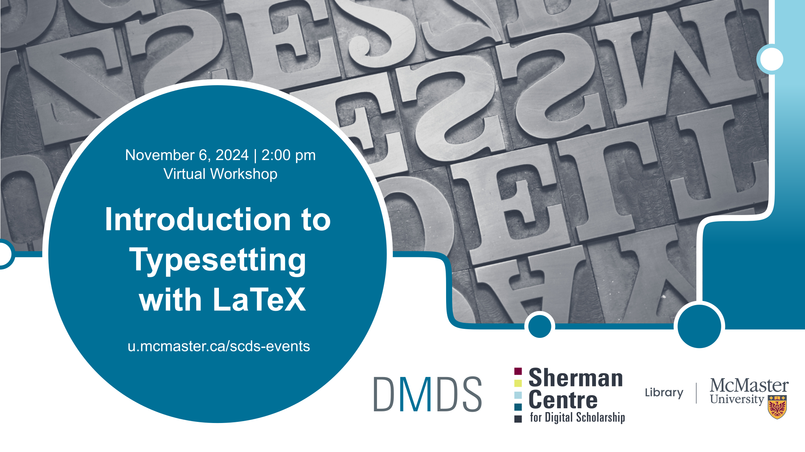

# Introduction to Typesetting with LaTeX

This workshop will introduce you to [LaTeX](www.latex-project.org/), a typesetting system commonly used in STEM disciplines to create high-quality documents and easily write mathematical equations.

In this tutorial, we will discuss tools for writing in LaTeX, the structural elements of LaTeX, text formatting, and commands for writing mathematical equations. You will also learn the commands to create your first LaTeX document.

[Register for this workshop](https://libcal.mcmaster.ca/calendar/scds/latex){: .btn .btn-outline }

## Workshop Preparation 

## Facilitator Bios

John Fink (he/they) is the Digital Scholarship Librarian at McMaster University Library. Their talents lie in complex and innovative systems administration and project management. He also has an interest in the maker/hacker element in digital scholarship, and is frequently spotted tinkering with esoteric hardware. If you are interested in having the Sherman Centre support your project, John is an excellent first contact.

Katie is a learning support librarian who works with the Faculty of Engineering to help engineering students learn how to understand, find, read, interpret, and create different types of information sources. She has spent the last decade teaching and providing research support to students and researchers in science and engineering. Her recent projects have focused on the development of some exciting new open educational resources.

<!--
## Contents

|Segment|Time Allotted|Key Topics / Activities|
|:--|:--|:--|
|**Introductory remarks**|20 minutes|Introduction to text preparation and analysis   Overview of concepts and methods   Key considerations for different source materials and analyses|
-->

  
## Workshop Recording
*Coming soon*.

<!--
<iframe height="416" width="100%" allowfullscreen frameborder=0 src="https://echo360.ca/media/9602ee54-24a4-4c61-bfd1-a8aa550a1cd5/public"></iframe>
[View original here.](https://echo360.ca/media/9602ee54-24a4-4c61-bfd1-a8aa550a1cd5/public)
-->

## Workshop Slides
*Coming soon*.

<!--
<embed src="assets/docs/textAnalysisSlides.pdf" style="border:none;" width="100%" height="466px">
[Download as PDF.](assets/docs/textAnalysisSlides.pdf)
-->

<!--
## Links and Resources 
- [Constellate](https://constellate.org/) is a text analysis learning and analysis platform supported by JSTOR Labs and ITHAKA. 
-->

