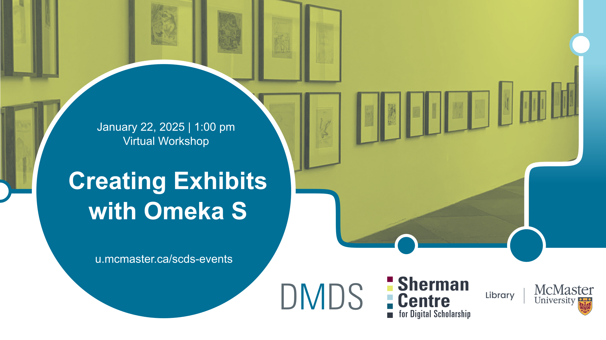

# Creating Exhibitions with Omeka S

Learn how to use Omeka S to manage digital collections and create scholarly exhibits. This tutorial will introduce participants to the basic functions of Omeka S, including how to create an archival item collection, add metadata, and build a digital exhibit.

[Register for this workshop](.){: .btn .btn-outline }

## Workshop Preparation 
*Coming soon.*

## Facilitator Bio

Subhanya Sivajothy (she/her) brings a background of research in data justice, science and technology studies, and environmental humanities. She is currently thinking through participatory data design which allow for visualizations that are empowering for the end user.

<!--
## Contents

|Segment|Time Allotted|Key Topics / Activities|
|:--|:--|:--|
|**Introductory remarks**|20 minutes|Introduction to text preparation and analysis   Overview of concepts and methods   Key considerations for different source materials and analyses|
-->

  
## Workshop Recording
*Coming soon*.

<!--
<iframe height="416" width="100%" allowfullscreen frameborder=0 src="https://echo360.ca/media/9602ee54-24a4-4c61-bfd1-a8aa550a1cd5/public"></iframe>
[View original here.](https://echo360.ca/media/9602ee54-24a4-4c61-bfd1-a8aa550a1cd5/public)
-->

## Workshop Slides
*Coming soon*.

<!--
<embed src="assets/docs/textAnalysisSlides.pdf" style="border:none;" width="100%" height="466px">
[Download as PDF.](assets/docs/textAnalysisSlides.pdf)
-->

<!--
## Links and Resources 
- [Constellate](https://constellate.org/) is a text analysis learning and analysis platform supported by JSTOR Labs and ITHAKA. 
-->

