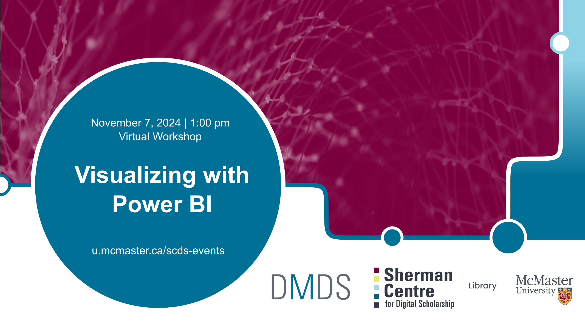

# Visualizing with Power BI

This workshop covers the basic of using Power BI to create visualizations. We will look at data cleaning, creating impactful charts, and building interactive dashboards. Discover how to tell your data story effectively and make informed decisions. No previous experience needed. 

## Workshop Preparation 
Access to Power BI is required. McMaster members can access the desktop version [here](https://office365.mcmaster.ca/office-365-3/applications/power-bi/getting-started-with-power-bi/). Those without access to Power BI through their organization may be able to access a [free trial](https://www.microsoft.com/en-us/power-platform/products/power-bi/getting-started-with-power-bi) via Microsoft, so that they can participate in the workshop. Please note that the desktop version only works with Windows OS; participants can instead use Power BI online but it has much more limited features.

The data that we will be using during the workshop can be downloaded [here](../data/humdata_GHGEmissionsGES.xlsx).

## Facilitator Bios

Subhanya Sivajothy (she/her) brings a background of research in data justice, science and technology studies, and environmental humanities. She is currently thinking through participatory data design which allow for visualizations that are empowering for the end user. She also has experience in Research Data Management—particularly data cleaning and curation. Do not hesitate to reach out to her if you would like to talk more about data analysis and visualization as they evolve throughout the research process.

## Workshop Recording

<iframe height="416" width="100%" allowfullscreen frameborder=0 src="https://echo360.ca/media/9602ee54-24a4-4c61-bfd1-a8aa550a1cd5/public"></iframe>
[View original here.](https://echo360.ca/media/9602ee54-24a4-4c61-bfd1-a8aa550a1cd5/public)

<!-- ## Workshop Slides
*Coming soon*. -->

<!--
<embed src="assets/docs/textAnalysisSlides.pdf" style="border:none;" width="100%" height="466px">
[Download as PDF.](assets/docs/textAnalysisSlides.pdf)
-->

<!--
## Links and Resources 
- [Constellate](https://constellate.org/) is a text analysis learning and analysis platform supported by JSTOR Labs and ITHAKA. 
-->

